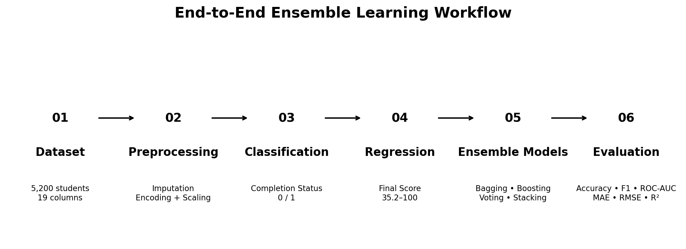
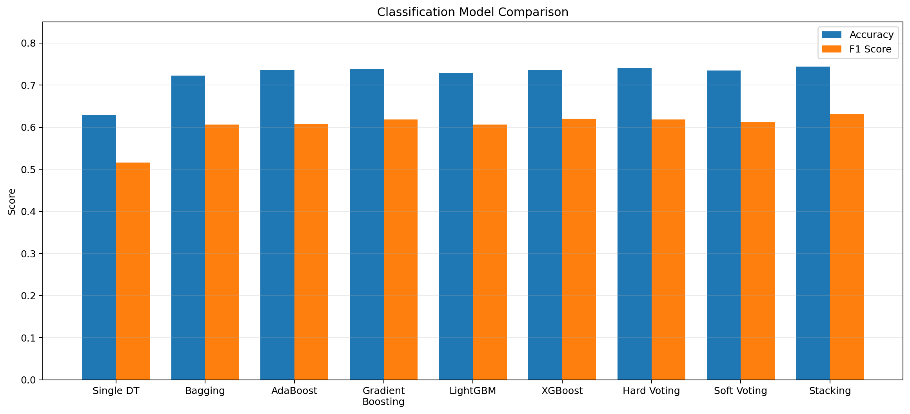
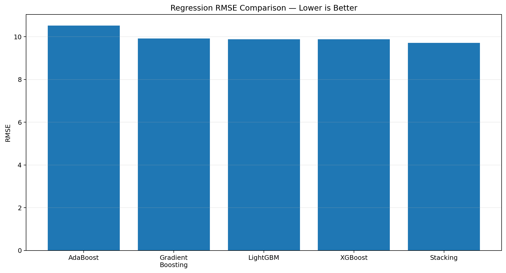
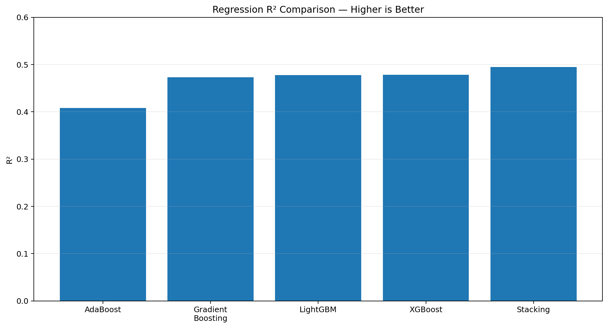

<div align="center">

# 🚀 Ensemble Learning — Classification & Regression

### A Complete Machine Learning Comparison of Bagging, Boosting, Voting & Stacking

<p align="center">
  
</p>

<p align="center">
  
  
  
  
  
  
  
</p>

<p>
<b>🎯 End-to-End Ensemble Learning Project</b><br>
Classification + Regression + Model Comparison + Performance Analysis
</p>

</div>

---

## 📌 Project Overview

This project demonstrates an end-to-end **Ensemble Learning** workflow using the dataset:

```text
dataset.5.csv
```

The project solves two machine-learning problems:

* 🎯 **Classification:** Predict `completion_status`
* 📈 **Regression:** Predict `final_score`

Multiple ensemble techniques are trained, evaluated, and compared to understand which approach performs best.

The main objective is to demonstrate how combining multiple machine-learning models can improve predictive performance compared with a single Decision Tree.

---

# 🏆 Final Results

| Task              | Best Model              |           Best Result |
| ----------------- | ----------------------- | --------------------: |
| 🟦 Classification | **Stacking Classifier** | Accuracy = **74.42%** |
| 🟦 Classification | **Stacking Classifier** |       F1 = **0.6316** |
| 🟦 Classification | **Stacking Classifier** |  ROC-AUC = **0.7940** |
| 🟩 Regression     | **Stacking Regressor**  |      MAE = **7.8049** |
| 🟩 Regression     | **Stacking Regressor**  |     RMSE = **9.7166** |
| 🟩 Regression     | **Stacking Regressor**  |       R² = **0.4947** |

> 🥇 **Stacking achieved the strongest reported performance for both classification and regression.**

---

# 🎯 Project Objectives

The main objectives of this project are:

* Understand Ensemble Learning
* Build a Decision Tree baseline
* Implement Bagging
* Implement AdaBoost
* Implement Gradient Boosting
* Implement LightGBM
* Implement XGBoost
* Compare Hard Voting and Soft Voting
* Implement Stacking
* Evaluate classification models
* Evaluate regression models
* Compare model performance
* Select the best-performing model

---

# 📊 Dataset Information

| Property              |                 Value |
| --------------------- | --------------------: |
| Dataset               |       `dataset.5.csv` |
| Rows                  |             **5,200** |
| Columns               |                **19** |
| Training Data         |             **4,160** |
| Testing Data          |             **1,040** |
| Train/Test Split      |             **80/20** |
| Processed Features    |                **30** |
| Missing-Value Columns | **3 numeric columns** |

### 🎯 Target Variables

```text
Classification Target → completion_status

Regression Target     → final_score
```

---

# 🔄 Machine Learning Workflow

```text
📂 Dataset
      ↓
🔍 Data Understanding
      ↓
🧹 Missing Value Handling
      ↓
🔤 Encoding
      ↓
📏 Feature Preparation / Scaling
      ↓
✂️ Train-Test Split
      ↓
🌳 Decision Tree Baseline
      ↓
👜 Bagging
      ↓
⚡ AdaBoost
      ↓
📈 Gradient Boosting
      ↓
💡 LightGBM
      ↓
🚀 XGBoost
      ↓
🗳️ Voting
      ↓
🧩 Stacking
      ↓
📊 Model Evaluation
      ↓
🏆 Best Model Selection
```

---

# 🧠 Ensemble Learning Techniques

## 🌳 1. Decision Tree

A Decision Tree is used as the **baseline model**.

It helps us understand whether ensemble methods provide an improvement over a single tree.

---

## 👜 2. Bagging

**Bagging = Bootstrap Aggregating**

Multiple models are trained on different bootstrap samples and their predictions are combined.

### Benefits

* Reduces variance
* Improves stability
* Reduces overfitting compared with a single tree

---

## ⚡ 3. AdaBoost

AdaBoost trains weak learners sequentially.

Each new learner focuses more on observations that were incorrectly predicted by previous learners.

```text
Weak Learner
      ↓
Find Errors
      ↓
Increase Importance
      ↓
Next Learner
      ↓
Final Combined Prediction
```

---

## 📈 4. Gradient Boosting

Gradient Boosting builds models sequentially where every new model tries to reduce the errors made by previous models.

It is powerful for both:

* Classification
* Regression

---

## 💡 5. LightGBM

LightGBM is a gradient-boosting framework designed for efficient and fast tree-based learning.

It is evaluated in this project for both classification and regression.

---

## 🚀 6. XGBoost

XGBoost is another powerful gradient-boosting algorithm.

It is evaluated against other ensemble techniques to compare predictive performance.

---

## 🗳️ 7. Voting

Voting combines predictions from multiple models.

### Hard Voting

The final class is selected using the majority vote.

```text
Model 1 → Class 1
Model 2 → Class 0
Model 3 → Class 1

Final → Class 1
```

### Soft Voting

Soft Voting combines predicted probabilities and selects the class with the highest combined probability.

---

## 🧩 8. Stacking

Stacking combines several base learners and then uses another model called a **meta-model** to make the final prediction.

```text
Model 1 ─┐
Model 2 ─┤
Model 3 ─┼──→ Meta Model ──→ Final Prediction
Model 4 ─┤
Model 5 ─┘
```

---

# 🧹 Data Preprocessing

The notebook performs the following preprocessing steps:

* Dataset loading
* Feature and target separation
* Missing-value handling
* Categorical feature encoding
* Numerical feature preparation
* Feature scaling where required
* Train/Test splitting

After preprocessing, the feature space contains:

```text
30 Features
```

---

# 🟦 Classification Model Comparison

Classification models were evaluated using:

* Accuracy
* Precision
* Recall
* F1 Score
* ROC-AUC

| Model             |   Accuracy | Precision | Recall |         F1 |    ROC-AUC |
| ----------------- | ---------: | --------: | -----: | ---------: | ---------: |
| Decision Tree     |     0.6298 |         — |      — |     0.5157 |     0.6090 |
| Bagging           |     0.7221 |    0.6472 | 0.5692 |     0.6057 |     0.7739 |
| AdaBoost          |     0.7365 |    0.6883 | 0.5436 |     0.6074 |     0.7850 |
| Gradient Boosting |     0.7385 |    0.6832 | 0.5641 |     0.6180 |     0.7896 |
| LightGBM          |     0.7288 |    0.6656 | 0.5564 |     0.6061 |     0.7805 |
| XGBoost           |     0.7356 |    0.6727 | 0.5744 |     0.6196 |     0.7875 |
| Hard Voting       |     0.7413 |    0.6921 | 0.5590 |     0.6184 |          — |
| Soft Voting       |     0.7346 |    0.6770 | 0.5590 |     0.6124 |          — |
| **Stacking**      | **0.7442** |         — |      — | **0.6316** | **0.7940** |

---

## 🥇 Best Classification Model

### Stacking Classifier

```text
Accuracy  → 0.7442
F1 Score  → 0.6316
ROC-AUC   → 0.7940
```

<p align="center">
  
</p>

---

# 🟩 Regression Model Comparison

Regression models were evaluated using:

* MAE
* RMSE
* R² Score

| Model             |        MAE |       RMSE |         R² |
| ----------------- | ---------: | ---------: | ---------: |
| AdaBoost          |     8.5452 |    10.5174 |     0.4080 |
| Gradient Boosting |     7.9645 |     9.9190 |     0.4734 |
| LightGBM          |     7.9309 |     9.8756 |     0.4780 |
| XGBoost           |     7.9205 |     9.8749 |     0.4781 |
| **Stacking**      | **7.8049** | **9.7166** | **0.4947** |

---

## 🥇 Best Regression Model

### Stacking Regressor

```text
MAE  → 7.8049
RMSE → 9.7166
R²   → 0.4947
```

<p align="center">
  
</p>

<p align="center">
  
</p>

---

# 🆚 Decision Tree vs Bagging

| Metric                  | Decision Tree |     Bagging |
| ----------------------- | ------------: | ----------: |
| Classification Accuracy |        0.6298 |  **0.7221** |
| Regression RMSE         |       14.3772 | **10.0406** |
| Regression R²           |       -0.1063 |  **0.4604** |

### 📌 Observation

Bagging produced a significant improvement over the single Decision Tree baseline.

```text
Classification Accuracy

Decision Tree → 0.6298
Bagging       → 0.7221
```

Regression performance also improved substantially:

```text
RMSE

Decision Tree → 14.3772
Bagging       → 10.0406
```

---

# 🗳️ Hard Voting vs Soft Voting

| Voting Method   |   Accuracy |  Precision | Recall |         F1 |
| --------------- | ---------: | ---------: | -----: | ---------: |
| **Hard Voting** | **0.7413** | **0.6921** | 0.5590 | **0.6184** |
| Soft Voting     |     0.7346 |     0.6770 | 0.5590 |     0.6124 |

### 🏆 Result

For the reported results, **Hard Voting performed better than Soft Voting** on Accuracy, Precision and F1.

---

# 📐 Evaluation Metrics

## Classification Metrics

### Accuracy

```text
Accuracy = Correct Predictions / Total Predictions
```

### Precision

```text
Precision = TP / (TP + FP)
```

### Recall

```text
Recall = TP / (TP + FN)
```

### F1 Score

```text
F1 = 2 × (Precision × Recall)
     --------------------------------
       Precision + Recall
```

### ROC-AUC

ROC-AUC measures how effectively a classification model separates the classes across different decision thresholds.

---

## Regression Metrics

### MAE

Mean Absolute Error measures the average absolute difference between actual and predicted values.

### RMSE

Root Mean Squared Error gives greater importance to larger prediction errors.

### R² Score

R² represents the proportion of variance explained by the regression model.

---

# 📸 Project Visualizations

## 🔄 Workflow

<p align="center">
  
</p>

---

## 📊 Classification Performance

<p align="center">
  
</p>

---

## 📈 Regression RMSE

<p align="center">
  
</p>

---

## 📈 Regression R²

<p align="center">
  
</p>

---

# 🏗️ Project Structure

```text
Ensemble-Learning/
│
├── 📓 project5.ipynb
├── 📄 dataset.5.csv
├── 📄 README.md
│
└── 📁 assets/
    │
    ├── 🖼️ workflow.png
    ├── 🖼️ classification_model_comparison.png
    ├── 🖼️ regression_rmse_comparison.png
    ├── 🖼️ regression_r2_comparison.png
    ├── 🖼️ notebook_output_1.png
    └── 🖼️ notebook_output_2.png
```

---

# 💻 Technologies Used

| Technology          | Purpose             |
| ------------------- | ------------------- |
| 🐍 Python           | Programming         |
| 🐼 Pandas           | Data Manipulation   |
| 🔢 NumPy            | Numerical Computing |
| 📊 Matplotlib       | Visualization       |
| 🤖 Scikit-learn     | Machine Learning    |
| 💡 LightGBM         | Gradient Boosting   |
| 🚀 XGBoost          | Gradient Boosting   |
| 📓 Jupyter Notebook | Development         |

---

# ⚙️ Installation

Clone the repository:

```bash
git clone <YOUR-GITHUB-REPOSITORY-URL>
```

Move into the project:

```bash
cd <YOUR-PROJECT-FOLDER>
```

Install required libraries:

```bash
pip install pandas numpy matplotlib scikit-learn lightgbm xgboost jupyter
```

Launch Jupyter Notebook:

```bash
jupyter notebook
```

Open:

```text
project5.ipynb
```

Then run all cells.

---

# 📌 Important File Requirement

Make sure the dataset is located in the same directory as the notebook:

```text
project5.ipynb
dataset.5.csv
```

Otherwise the dataset-loading cell may generate a file-not-found error.

---

# 🎓 Key Learnings

This project helped demonstrate:

* Ensemble Learning fundamentals
* Bootstrap Aggregation
* Bagging
* Boosting
* AdaBoost
* Gradient Boosting
* LightGBM
* XGBoost
* Voting Classifier
* Hard Voting
* Soft Voting
* Stacking
* Classification metrics
* Regression metrics
* Model comparison
* Baseline comparison
* Model selection

---

# 🔍 Key Insights

### Insight 1 — Ensemble > Single Tree

Bagging significantly improved the reported baseline performance.

### Insight 2 — Boosting is Powerful

AdaBoost, Gradient Boosting, LightGBM and XGBoost all produced stronger results than the single Decision Tree on the reported classification metrics.

### Insight 3 — Voting Strategies Differ

Hard Voting slightly outperformed Soft Voting on the reported classification metrics.

### Insight 4 — Stacking Performed Best

Stacking achieved the strongest reported results in both tasks.

```text
Classification
Accuracy → 74.42%
F1       → 0.6316
ROC-AUC  → 0.7940

Regression
MAE  → 7.8049
RMSE → 9.7166
R²   → 0.4947
```

---

# ✅ Project Checklist

* [x] Dataset Loading
* [x] Data Understanding
* [x] Missing Value Handling
* [x] Encoding
* [x] Feature Preparation
* [x] Train-Test Split
* [x] Decision Tree
* [x] Bagging
* [x] AdaBoost
* [x] Gradient Boosting
* [x] LightGBM
* [x] XGBoost
* [x] Hard Voting
* [x] Soft Voting
* [x] Stacking
* [x] Classification Evaluation
* [x] Regression Evaluation
* [x] Model Comparison
* [x] Best Model Selection
* [x] Visualization
* [x] Final Analysis

---

# 🏁 Conclusion

This project demonstrates how different **Ensemble Learning techniques** can be applied to both classification and regression problems.

The comparison shows that combining multiple learners can provide stronger and more stable results than relying on a single Decision Tree.

### 🏆 Final Winner

**Stacking**

```text
Classification → Best reported overall result
Regression     → Best reported overall result
```

The project provides practical experience with the complete machine-learning workflow:

```text
Data
 ↓
Preprocessing
 ↓
Model Training
 ↓
Ensemble Learning
 ↓
Evaluation
 ↓
Comparison
 ↓
Best Model
```

---

<div align="center">

# ⭐ If you found this project useful, please give the repository a star!

### 🐍 Python | 🤖 Machine Learning | 📊 Ensemble Learning

**Made with ❤️ by Manan**

</div>
